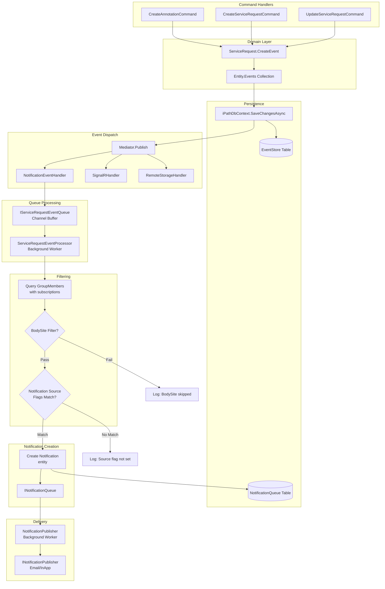
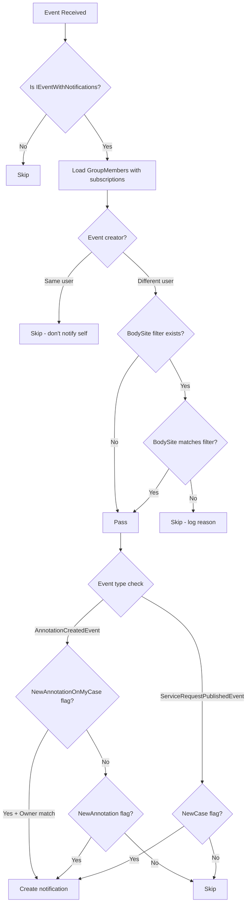

# Notification Processing Flow

## Overview

The notification system uses a **Mediator Pattern with Background Worker Queues** to process events asynchronously. When a `ServiceRequest` or `Annotation` is created or modified, events are dispatched through a pipeline that filters and delivers notifications to subscribed users.

## Architecture

### Event Flow Diagram



## Key Components

| Component | File | Responsibility |
|-----------|------|----------------|
| `EventEntity` | `src/core/iPath.Domain/Entities/Base/EventEntity.cs` | Base class for all domain events |
| `ServiceRequestEvent` | `src/core/iPath.Domain/Entities/ServiceRequests/ServiceRequestEvent.cs` | Base for ServiceRequest-related events |
| `IEventWithNotifications` | `src/core/iPath.Domain/Entities/ServiceRequests/ServiceRequestEvent.cs` | Marker interface for events that trigger notifications |
| `iPathDbContext` | `src/infrastructure/iPath.Database.EFCore/Database/iPathDbContext.cs` | Persists events to EventStore and dispatches via Mediator |
| `NotificationEventHandler` | `src/core/iPath.Application/Features/Notifications/NodeNotificationEventHandlers.cs` | Routes events to processing queue |
| `ServiceRequestEventQueue` | `src/core/iPath.Application/Features/Notifications/ServiceRequestEventQueue.cs` | Channel buffer for events |
| `ServiceRequestEventProcessor` | `src/infrastructure/iPath.API/Services/Notifications/Processors/ServiceRequestEventProcessor.cs` | Core filtering logic |
| `Notification` | `src/core/iPath.Domain/Entities/Notifications/Notification.cs` | Persistent notification entity |

## Event Types

### Events That Trigger Notifications

| Event Class | Marker Interface | Notification Source Flag |
|-------------|-----------------|-------------------------|
| `AnnotationCreatedEvent` | `IEventWithNotifications` | `NewAnnotation` or `NewAnnotationOnMyCase` |
| `ServiceRequestPublishedEvent` | `IEventWithNotifications` | `NewCase` |

### Events Without Notifications

| Event Class | Description |
|-------------|-------------|
| `ServiceRequestCreatedEvent` | Draft creation, no notification |
| `ServiceRequestUpdatedEvent` | General updates |
| `ServiceRequestDescriptionUpdatedEvent` | Description changes |
| `ServiceRequestDeletedEvent` | Deletion |
| `AnnotationDeletedEvent` | Annotation removal |
| `ChildNodeCreatedEvent` | Child node creation |

## Filtering Logic

### Notification Source Flags

```csharp
[Flags]
public enum eNotificationSource
{
    None = 0,
    NewCase = 1,              // New ServiceRequest published
    NewAnnotation = 2,        // Any new annotation
    NewAnnotationOnMyCase = 4 // Annotations on owned cases only
}
```

### BodySite Filtering (ICD-O Topography)

Users can filter notifications by anatomical site using ICD-O topography codes:

```csharp
public class NotificationSettings
{
    public bool UseProfileBodySiteFilter { get; set; }
    public ConceptFilter? BodySiteFilter { get; set; }
}
```

- If `UseProfileBodySiteFilter == true`: Uses `User.Profile.SpecialisationBodySite`
- Otherwise: Uses `GroupMember.NotificationSettings.BodySiteFilter`

The `CodingService.InConceptFilter()` method checks if a ServiceRequest's BodySite code matches the filter, including child codes in the ICD-O hierarchy.

### Filter Evaluation Flow



## Database Schema

### EventStore Table

| Column | Type | Description |
|--------|------|-------------|
| `EventId` | GUID | Primary key |
| `EventDate` | DateTime | When event occurred |
| `UserId` | GUID | User who triggered the event |
| `EventName` | String | Event class name (e.g., "AnnotationCreatedEvent") |
| `ObjectName` | String | Entity type name |
| `ObjectId` | GUID | Entity ID |
| `Payload` | JSON | Serialized event data |

### NotificationQueue Table

| Column | Type | Description |
|--------|------|-------------|
| `Id` | GUID | Primary key |
| `CreatedOn` | DateTime | When notification was created |
| `ProcessedOn` | DateTime? | When notification was delivered |
| `Status` | Enum | Pending, Sent, or Failed |
| `UserId` | GUID | Recipient user |
| `ServiceRequestId` | GUID | Related ServiceRequest |
| `EventId` | GUID | Triggering event |
| `EventType` | Enum | NewAnnotation or NodePublished |
| `Target` | Enum | InApp or Email |
| `Data` | String? | Additional payload |

## Adding New Event Types

To add a new event that triggers notifications:

1. **Create the event class**:
   ```csharp
   public class MyNewEvent : ServiceRequestEvent, IEventWithNotifications { }
   ```

2. **Create the event input** (if needed):
   ```csharp
   public record MyNewCommand(...) : IRequest<...>, IEventInput
   {
       public string ObjectName => nameof(ServiceRequest);
   }
   ```

3. **Raise the event** in your command handler:
   ```csharp
   sr.CreateEvent<MyNewEvent, MyNewCommand>(cmd, userId);
   ```

4. **Add filtering logic** in `NotificationFilterService`:
   ```csharp
   else if (evt is MyNewEvent)
   {
       if (subscription.NotificationSource.HasFlag(eNotificationSource.MyNewSourceType))
       {
           return true;
       }
   }
   ```

## Testing

### Unit Tests Location
- `test/iPath.Test.xUnit2/Notifications/NotificationFilterTests.cs`

### Integration Tests Location
- `test/iPath.Test.xUnit2/Notifications/NotificationIntegrationTests.cs`

## Querying Events and Notifications

### API Endpoints

```http
GET /api/servicerequests/{id}/events
GET /api/servicerequests/{id}/notifications
```

### Example Response

```json
{
  "events": [
    {
      "eventId": "guid",
      "eventDate": "2026-03-26T10:00:00Z",
      "eventName": "AnnotationCreatedEvent",
      "userId": "guid",
      "objectId": "guid",
      "payload": "{...}"
    }
  ],
  "notifications": [
    {
      "id": "guid",
      "eventId": "guid",
      "eventType": "NewAnnotation",
      "userId": "guid",
      "status": "Sent",
      "target": "Email"
    }
  ]
}
```